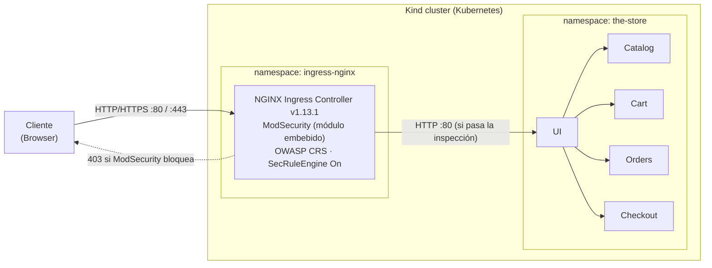

# The Store — WAF (ModSecurity + OWASP CRS)

En el repositorio actual se encuentra **The Store**, una plataforma de e-commerce con arquitectura de microservicios, sobre la que se implementó un **Web Application Firewall** en el borde como trabajo práctico de la materia 72.20 Redes de Información (ITBA).

El WAF (ModSecurity + OWASP Core Rule Set sobre ingress-nginx) inspecciona la totalidad del tráfico HTTP entrante antes de que este llegue a los microservicios: el tráfico legítimo se reenvía a la aplicación mientras que los ataques se bloquean con `403` en el borde, sin modificar el código de la aplicación.

En el presente documento se presenta una guía completa para desplegar el entorno, ponerlo en funcionamiento y reproducir las pruebas. Constituye la única documentación del trabajo: contiene tanto los pasos de instalación como la justificación de las decisiones de configuración.

## Arquitectura

Todo el tráfico HTTP externo entra por el WAF (ModSecurity + OWASP CRS, embebido en el ingress-nginx) antes de alcanzar los microservicios. El tráfico legítimo se reenvía al servicio de UI; los ataques se cortan con `403` en el borde, sin alcanzar la aplicación.



## Microservicios

| Servicio | Lenguaje | Descripción |
|----------|----------|-------------|
| [UI](./src/ui/) | Java (Spring Boot) | Interfaz web; actúa como proxy hacia el resto de los servicios |
| [Catalog](./src/catalog/) | Go | Catálogo de productos, búsqueda e imágenes |
| [Cart](./src/cart/) | Java (Spring Boot) | Carrito (Redis/DynamoDB) |
| [Orders](./src/orders/) | Java (Spring Boot) | Procesamiento de órdenes |
| [Checkout](./src/checkout/) | Node.js (NestJS) | Checkout y pago |


---

## 1. Prerrequisitos

- [Docker](https://docs.docker.com/get-docker/) en ejecución.
- [Kind](https://kind.sigs.k8s.io/docs/user/quick-start/#installation) instalado.
- [kubectl](https://kubernetes.io/docs/tasks/tools/install-kubectl/) instalado.

El cluster se ejecuta sobre [Kind](https://kind.sigs.k8s.io) (Kubernetes en Docker) y mapea los puertos `80` y `443` del host, de modo que la aplicación queda accesible en `http://localhost`. El puerto `80` debe estar libre. El ingress-nginx se instala fijado a la versión `controller-v1.13.1`.

## 2. Puesta en marcha

```bash
# Crea el cluster, construye las imágenes, despliega los servicios,
# instala el ingress y aplica la configuración del WAF.
./local.sh create-cluster
```

Al finalizar, The Store se encuentra accesible en **http://localhost** con el **WAF activo** en modo bloqueo (`SecRuleEngine On`). No se requiere ningún paso adicional para activarlo.

Nota: el comando ejecuta además los tests end-to-end. Para un arranque más rápido estos pueden ser omitidos, levantando el cluster con:

```bash
./local.sh create-cluster --skip-tests
```

Otros comandos disponibles:

```bash
./local.sh status            # estado del cluster, ingress y servicios
./local.sh rebuild-cluster   # elimina y recrea todo el entorno
./local.sh delete-cluster    # elimina el cluster
./local.sh reload-images     # reconstruye y recarga únicamente las imágenes
```

Para verificar que el WAF está activo (un endpoint protegido debe responder `403`):

```bash
curl -s -o /dev/null -w "%{http_code}\n" http://localhost/info   # 403 con WAF
```

## 3. Configuración del WAF

El WAF se aplica automáticamente al crear el cluster: `local.sh` aplica un patch de tipo *merge* sobre el ConfigMap `ingress-nginx-controller`. La configuración completa reside en [`dist/modsecurity-configmap.yaml`](./dist/modsecurity-configmap.yaml) y comprende:

- **ModSecurity y OWASP CRS** habilitados sobre el ingress, en modo bloqueo (`SecRuleEngine On`).
- **Paranoia level 2** y **anomaly threshold 5** como parámetros del CRS (justificación en la sección 3.1).
- **Dos exclusiones acotadas** (reglas `932200` y `932236`) restringidas al parámetro `q` de `/catalog/search`.
- **Cinco reglas custom** (virtual patching) para los endpoints propios de The Store que el CRS genérico no cubre (sección 5.1). Cuatro bloquean (`403`); la regla de scanner (`4001`) corre en **modo detección** por defecto: registra sin bloquear (sección 5.1).

### 3.1 Justificación de los parámetros del CRS

Los valores del Core Rule Set se determinaron mediante un análisis de detección frente a falsos positivos sobre el corpus de tráfico del proyecto:

| Parámetro | Valor | Justificación |
|-----------|-------|---------------|
| Paranoia level | **2** | Bloquea 11 ataques ofuscados que el nivel 1 no detecta (operadores SQL como `1 OR 1` o `@@version`, cadenas codificadas en hexadecimal, ejecución remota mediante backticks) sin introducir falsos positivos sobre lenguaje natural. Es el nivel recomendado por la documentación del CRS para una tienda online estándar. Los niveles 3 y 4 incrementan los falsos positivos sin aportar detección adicional medible. |
| Anomaly threshold | **5** (valor por defecto del CRS) | El CRS acumula un puntaje de anomalía por request —cada regla que coincide suma según su severidad— y bloquea cuando el puntaje alcanza el umbral. Con el valor 5 basta una única regla crítica para bloquear, la postura más estricta. Elevarlo solo intercambia detección de señales débiles por una reducción marginal de falsos positivos. |
| Exclusiones `932200` y `932236` sobre `ARGS:q` | — | En paranoia level 2 el buscador genera falsos positivos: los símbolos aritméticos activan la regla `932200` ("RCE Bypass Technique") y los nombres de comando Unix aislados (p. ej. `red`, `watch`, `knife`) activan la `932236` ("RCE Unix Command Injection"). Las exclusiones desactivan únicamente esas dos reglas, y solo sobre ese parámetro; la detección de SQLi y XSS (reglas `942xxx`/`941xxx`) y de command injection real (otras reglas `93xxxx`) permanece activa. |

El threshold se mantiene en 5 y los falsos positivos se corrigen con exclusiones acotadas en lugar de elevar el umbral, de modo que el ajuste no debilita la detección de forma global.

> **Detección como alternativa a la exclusión.** La misma postura de detección que se aplica a la regla de scanner (sección 5.1) podría usarse para estas dos reglas: en lugar de excluir `932200`/`932236` sobre `ARGS:q`, mantenerlas activas pero registrando el match sin sumarlo al bloqueo. Se optó por la exclusión acotada porque, en un campo de búsqueda, esos matches son patrones benignos conocidos (símbolos aritméticos, nombres de comando Unix) sin valor de investigación, mientras que el reconocimiento de un scanner sí conviene registrarlo.

## 4. Probar el WAF

### 4.1 Encendido y apagado simplificado del WAF

Para comparar el comportamiento con y sin protección es necesario alternar el estado del WAF.

**Desactivar** (los ataques alcanzan el backend y la vulnerabilidad se manifiesta):

```bash
./demo-scripts/turn-waf-off.sh
```

**Activar** (reaplica `SecRuleEngine On` junto con todas las reglas custom):

```bash
./demo-scripts/turn-waf-on.sh
```

El controller recarga nginx al detectar el cambio en el ConfigMap, lo que demora unos segundos. El estado puede verificarse, por ejemplo, con `curl http://localhost/info` (`200` sin WAF, `403` con WAF).

### 4.2 Tests contra el WAF

#### Opción A — scripts automatizados (recomendado)

Con el cluster en ejecución, los scripts en `src/waf-tests/` ejercitan distintos casos de peticiones al servidor y reportan un resumen (`✓`/`✗`) comparando el código de estado HTTP. Para un ataque, el éxito corresponde a `403`; para tráfico legítimo, a cualquier código distinto de `403`.

```bash
# Casos del pre-entrega:
./src/waf-tests/attacks.sh       # ataques  -> 403
./src/waf-tests/happy-path.sh    # legítimo -> 200
./src/waf-tests/mixed.sh         # ambos

# Corpus amplio:
./src/waf-tests/attacks-corpus.sh   # ataques
./src/waf-tests/happy-corpus.sh     # legítimos
```

Los scripts apuntan a `http://localhost` por defecto; el destino puede sobrescribirse mediante la variable `WAF_TEST_URL`.

#### Opción B — ejecuciones manuales

Alternativamente, cada caso puede ejecutarse de forma individual con `curl`, lo que permite observar el comportamiento del WAF sobre una petición concreta. Los comandos de cada categoría se detallan en la sección 5; combinándolos con el encendido y apagado del WAF (sección 4.1) se contrasta el resultado **sin WAF** (la petición alcanza el backend y la vulnerabilidad se manifiesta) contra **con WAF** (la petición se bloquea con `403` en el borde).

Para inspeccionar únicamente el código de estado de la respuesta conviene agregar las opciones `-s -o /dev/null -w "%{http_code}\n"`:

```bash
curl -s -o /dev/null -w "%{http_code}\n" http://localhost/info   # 200 sin WAF, 403 con WAF
```

> **SQLi / XSS:** utilizar siempre `curl --get --data-urlencode "q=..."`. Si el
> payload se incluye sin codificar en la URL, `curl` genera una línea de request
> malformada y nginx la rechaza (`400`) antes de alcanzar ModSecurity, lo que no
> constituye un resultado válido.

## 5. Qué protege el WAF

### 5.1 Reglas custom (endpoints propios de The Store)

| Categoría | Endpoints | Regla | Qué evita |
|-----------|-----------|:-----:|-----------|
| IDOR — proxy interno | `/proxy/*` (ej. `/proxy/carts/{id}`, `/proxy/orders/{id}`) | `1001` | Acceso externo a endpoints internos → datos de otros clientes |
| Endpoints administrativos | `/utility/*` (salvo origen `127.0.0.1`) | `2002` | DoS, consumo intensivo de CPU, operaciones arbitrarias, fuga de información |
| Exposición de info | `/info`, `/topology` | `1003`, `1004` | Exposición de configuración y topología interna |
| Scanners automáticos | cualquier ruta con `User-Agent` de `sqlmap`, `nikto`, `nmap` o `wpscan` | `4001` | Registra el reconocimiento (modo **detección**, ver más abajo) |

> **Regla 2002 — fuente de la IP.** La pre-entrega plantea filtrar por el header `X-Forwarded-For`. La implementación usa `REMOTE_ADDR` (la IP de la conexión TCP que ve nginx): `X-Forwarded-For` lo controla el cliente y queda *undefined* cuando no lo envía, en cuyo caso la regla *chained* no dispararía y `/utility/*` quedaría expuesto. `REMOTE_ADDR` siempre existe y no es spoofeable a nivel HTTP, por lo que cumple el objetivo (restringir los endpoints administrativos a IPs autorizadas) de forma más robusta. En producción detrás de un balanceador se volvería a `X-Forwarded-For` con `trusted-proxies` configurado.

Comandos de prueba (resultado **sin WAF** → **con WAF**):

```bash
curl http://localhost/proxy/carts/123                          # 200        -> 403
curl http://localhost/info                                     # 200        -> 403
curl http://localhost/topology                                 # 200        -> 403
curl http://localhost/utility/headers                          # 200 (leak) -> 403
curl -X POST -H "Content-Type: application/json" \
     -d '{"a":"b"}' http://localhost/utility/store             # 200        -> 403
curl -A "sqlmap/1.7" "http://localhost/catalog/search?q=test"  # 200        -> 200 (detectado y logueado, no bloqueado)
```

**Modo detección de la regla de scanner (`4001`).** A diferencia de las otras cuatro reglas custom, `4001` no bloquea: corre en **modo detección** por defecto. Un `User-Agent` es trivialmente falsificable —un atacante real lo cambia y evade el bloqueo—, de modo que bloquearlo aporta poca protección; en cambio, registrar el intento de reconocimiento sí tiene valor de visibilidad. Por eso la regla **registra el match en el audit log pero deja pasar el request** (`200`).

Al coincidir el `User-Agent`, la regla aplica `ctl:ruleEngine=DetectionOnly`, que pone toda la transacción en modo detección (cada regla evalúa y registra, ninguna bloquea). Esto además neutraliza la regla de scanner del propio CRS (`913100`, que de otro modo bloquearía estos `User-Agent` por su cuenta) y la colisión del término `nmap` con la lista de comandos Unix del CRS.

El modo es reversible y se aplica sin downtime (recarga in-process del ingress):

```bash
./demo-scripts/scanner-mode.sh block    # 4001 pasa a bloquear (403)
./demo-scripts/scanner-mode.sh detect   # vuelve a detección (default; imprime la evidencia del audit log)
```

En los scripts de prueba, los casos de scanner se evalúan con el criterio `detect`: el éxito es que el WAF **no** bloquee (y registre el match), no el `403`. El gate `attacks.sh` da `18/18` en cualquiera de los dos modos.

> **Nota sobre la pre-entrega.** La pre-entrega definía la regla `4001` con `deny,status:403` (bloqueo). El modo detección es un refinamiento posterior por el razonamiento de arriba (el `User-Agent` es falsificable). El comportamiento de bloqueo comprometido en la pre-entrega sigue disponible y a un solo comando: `./demo-scripts/scanner-mode.sh block`.

### 5.2 Inyección genérica (OWASP CRS)

El CRS inspecciona la totalidad del tráfico; las vulnerabilidades reales de la aplicación se concentran en dos endpoints del catálogo:

- `GET /catalog/search?q=` — búsqueda con SQL concatenado; refleja `q` en la respuesta JSON.
- `GET /catalog/image?file=` — `ReadFile` sin validar `..` en la ruta.

> **Barra de búsqueda: HTML para el usuario, JSON para la API.** El mismo endpoint `/catalog/search` atiende a dos clientes sobre la misma URI: el formulario del navegador agrega el marcador `view=html` y recibe la página de resultados renderizada (menú de categorías y grilla de productos), mientras que `curl`, los scripts de `waf-tests` y los ataques llegan sin `view` y obtienen el JSON crudo descripto arriba. Al compartir la URI, la búsqueda del usuario queda bajo la misma cobertura del WAF y el mismo ajuste de falsos positivos sobre `ARGS:q` (sección 3.1): un ataque por la barra se bloquea en el borde igual que por la API, y la aplicación permanece deliberadamente vulnerable para que esa protección sea demostrable.

| Familia de ataque | Reglas CRS | Endpoint de prueba |
|-------------------|:----------:|--------------------|
| SQL injection | `942xxx` | `/catalog/search?q=` |
| XSS | `941xxx` | `/catalog/search?q=` |
| Path traversal / LFI | `930xxx`, `931xxx` | `/catalog/image?file=` |
| Command injection | `932xxx` | `/catalog/search?q=` |
| Otros (SSTI, LDAP, NoSQL, XXE, shellshock, log4shell) | varias | `/catalog/search?q=` |

Comandos de prueba:

```bash
# SQL injection (sin WAF devuelve el catálogo completo o un error 500)
curl --get --data-urlencode "q=' OR 1=1--" http://localhost/catalog/search
curl --get --data-urlencode "q=' UNION SELECT password FROM users--" http://localhost/catalog/search

# XSS (sin WAF refleja el payload en el campo "query")
curl --get --data-urlencode "q=" http://localhost/catalog/search

# Path traversal (sin WAF devuelve el contenido del archivo)
curl "http://localhost/catalog/image?file=../../../../etc/passwd"
curl "http://localhost/catalog/image?file=../../../../proc/self/environ"
```

El listado completo de payloads que cubre el corpus (30 SQLi, 25 XSS, 20 traversal, 12 command injection, 13 protocolos varios, 12 scanners) se encuentra en [`src/waf-tests/corpus.sh`](./src/waf-tests/corpus.sh).

### 5.3 Endpoints destructivos (DoS / CPU)

Estos endpoints **afectan al cluster** si alcanzan el backend. Para observar el impacto real sin WAF, utilizar un cluster descartable y recrearlo posteriormente con `./local.sh rebuild-cluster`.

| Endpoint | Sin WAF | Con WAF |
|----------|---------|:-------:|
| `/utility/panic` | provoca la caída del pod de UI | **403** |
| `/utility/health/down` | marca el pod como unhealthy → 502 hasta el reinicio | **403** |
| `/utility/stress/{n}` | consumo intensivo de CPU, degrada el rendimiento | **403** |

## 6. Identificar la regla que se activó en un request

Con el WAF en modo bloqueo, el rechazo se refleja en el código de estado `403`. Para identificar la regla que se activó, consultar el audit log dentro del pod del controller:

```bash
kubectl -n ingress-nginx exec deploy/ingress-nginx-controller -- \
  sh -c 'find /var/log/audit -type f | sort | tail -1 | xargs cat'
```

Cada entrada incluye el `[id "..."]` y el `[msg "..."]` de la regla (p. ej.
`id "1001"`, `msg "IDOR_proxy_endpoint_blocked"`).

Esto es especialmente relevante para las reglas en **modo detección** (como la de scanner, sección 5.1): al no bloquear, el audit log es la **única** señal de que se detectó el patrón. Un scanner detectado aparece con `id "4001"` y `msg "malicious_scanner_detected"` aunque el request haya devuelto `200`.

> **Persistencia (alcance del PoC).** Tanto el audit log (archivos en el filesystem efímero del Pod del controller) como el stream de `kubectl logs` (que el kubelet retiene solo para el contenedor actual) se pierden si el Pod se reinicia o se recrea el cluster. Para este PoC es suficiente: el objetivo es **generar** logs estructurados y auditables (IP de origen, endpoint, payload, regla), no retenerlos. El paso a producción es directo porque las denegaciones ya salen por **stdout/stderr** —el stream nativo que recolecta cualquier pipeline de logs de Kubernetes—: alcanza con agregar un colector (p. ej. Fluent Bit como DaemonSet) que envíe esos eventos a un store central (Loki / Elasticsearch / SIEM), opcionalmente con `SecAuditLogFormat JSON` para parseo directo.

## 7. Ajuste del CRS y demostraciones complementarias (opcional)

### 7.1 Demo del ajuste del CRS

`demo-scripts/crs-tuning/demo-flip.sh` recorre —con pausas para narrar— cómo una búsqueda legítima con símbolos (`q=1+2-3*4/5=6`, p. ej. un código de producto) cambia de comportamiento según el ajuste del CRS:

```bash
./demo-scripts/crs-tuning/demo-flip.sh   # PL1 pasa -> PL2 falso positivo -> corrección
```

| Estado | FP `1+2-3*4/5=6` | SQLi `' OR 1=1--` | XSS |
|--------|:----------------:|:-----------------:|:---:|
| PL1 | 200 | 403 | 403 |
| PL2 (sin tuning) | **403** (falso positivo) | 403 | 403 |
| **PL2 + exclusión** (default committeado) | 200 | 403 | 403 |
| PL2 + threshold 20 | 200 | 403 | 403 |

En PL2, la regla CRS `932200` ("RCE Bypass Technique") suma anomaly score 10 ≥ threshold 5, por lo que la `949110` bloquea (`403`). La exclusión acotada (`ctl:ruleRemoveTargetById=932200;ARGS:q`) corrige el falso positivo sin afectar SQLi/XSS; subir el threshold también lo corrige, pero de forma global (justificación completa en la sección 3.1).

Estados sueltos aplicables a mano con `set-crs.sh`:

```bash
./demo-scripts/crs-tuning/set-crs.sh --pl 2                 # paranoia level 2
./demo-scripts/crs-tuning/set-crs.sh --pl 2 --exclude-fp    # + exclusión de 932200 (la del FP de esta demo)
./demo-scripts/crs-tuning/set-crs.sh --pl 2 --threshold 20  # + threshold alto (instrumento grueso)
./demo-scripts/turn-waf-on.sh                               # restaura el ConfigMap committeado
```

Para reproducir los datos que respaldan la sección 3.1 (detección vs. falsos positivos por paranoia level, score de anomalía por request, y los 11 ataques que PL2 detecta y PL1 deja pasar):

```bash
./src/waf-tests/paranoia-sweep.sh    # detección vs FP por paranoia level -> paranoia-sweep.csv
./src/waf-tests/anomaly-scores.sh    # anomaly score por request          -> anomaly-scores.csv
./src/waf-tests/pl-detection-gap.sh  # ataques ofuscados que PL2 agrega sobre PL1
python3 src/waf-tests/plot-paranoia.py   # paranoia-sweep.csv  -> docs/images/paranoia-fp.png
python3 src/waf-tests/plot-anomaly.py    # anomaly-scores.csv  -> docs/images/anomaly-*.png
```

> El paranoia level y el threshold se fijan desde el ConfigMap con un `SecAction setvar:tx.blocking_paranoia_level=N`, que se carga antes del CRS (cuyo init es *set-if-unset*, así que ese valor gana). Parchear el ConfigMap recarga nginx **in-process** (~6 s) sin downtime; **no** usar `kubectl rollout restart` sobre el controller (réplica única con hostPort 80 en Kind → cortaría el tráfico).

### 7.2 Alternar la regla de scanner (detección / bloqueo)

Ver la sección 5.1 para el detalle del modo detección:

```bash
./demo-scripts/scanner-mode.sh block     # 4001 bloquea (403)
./demo-scripts/scanner-mode.sh detect    # 4001 detecta y registra, sin bloquear (default)
```

### 7.3 Demostraciones de impacto

Cada script restaura la configuración por defecto del WAF al finalizar:

```bash
./demo-scripts/impact/show-damage.sh        # datos filtrados sin WAF vs 403 con WAF
./src/waf-tests/availability.sh             # disponibilidad bajo ataque (con vs sin WAF)
./src/waf-tests/latency-overhead.sh         # overhead de latencia (ApacheBench)
```

Estos scripts escriben CSVs en `src/waf-tests/` y los `plot-*.py` los convierten en gráficos PNG en `docs/images/`. Tanto los CSVs como los PNG generados están fuera del control de versiones (se regeneran al correr los scripts).

## 8. Estructura del repositorio

```
local.sh                          gestión del cluster local (Kind)
dist/kubernetes.yaml              manifiestos de los microservicios
dist/modsecurity-configmap.yaml   configuración del WAF (reglas custom + CRS)
src/<servicio>/                   código de cada microservicio
src/waf-tests/                    scripts de validación, corpus y generación de gráficos
demo-scripts/                     activación del WAF, demo de ajuste del CRS y demostraciones
docs/images/                      diagrama de arquitectura (los gráficos generados no se versionan)
```
