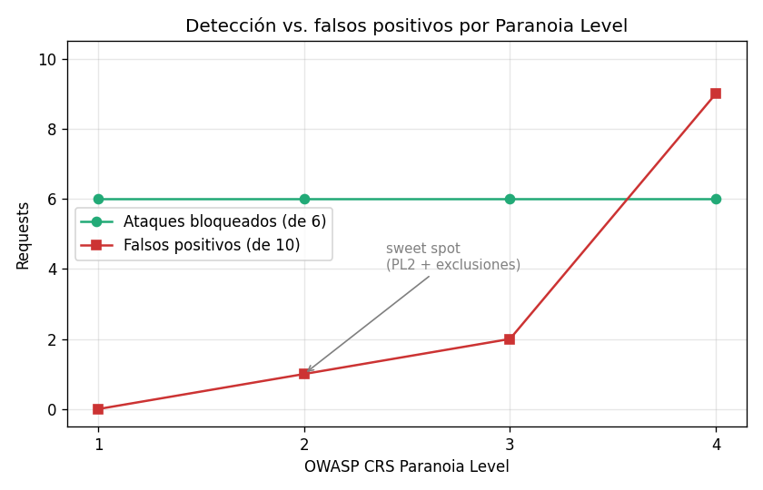
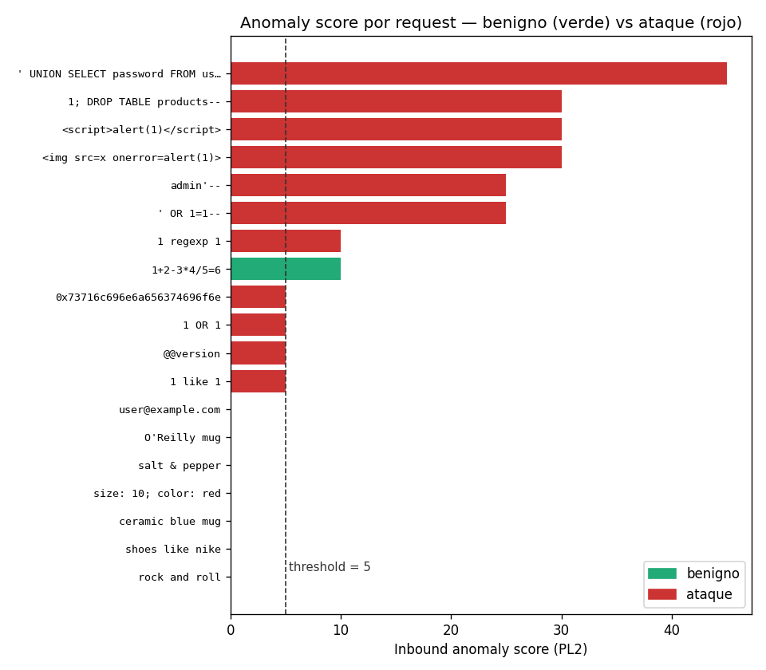
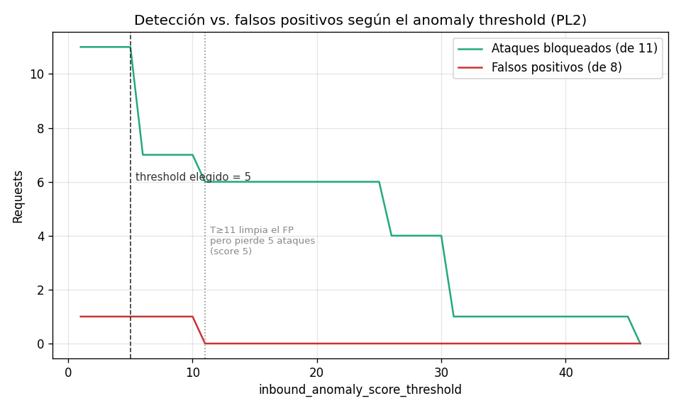

# Material para el informe — actualización de la sección 3.4 y correcciones

> Este archivo NO es documentación técnica del repo (esa está en `modsecurity.md`).
> Es texto **listo para pegar** en la fuente del informe (el PDF de la pre-entrega),
> redactado en el mismo tono formal, reflejando lo que efectivamente se implementó.
> Las figuras referenciadas están en `docs/images/`.

---

## Corrección a incorporar en 3.2 (Endpoints Administrativos)

La implementación de la regla de mitigación de endpoints administrativos difiere de
lo planteado originalmente. El pre-entrega proponía evaluar el header
`X-Forwarded-For` contra una allowlist de IPs, asumiendo que nginx lo
sobrescribiría con la IP real del cliente. En la práctica, en la fase de análisis
(`phase:1`) ModSecurity observa los headers tal como los envió el cliente: si el
cliente no envía `X-Forwarded-For`, la variable queda indefinida y la regla
encadenada no dispara, dejando el endpoint expuesto; y si lo envía, es trivialmente
falsificable. Por ese motivo la regla final evalúa `REMOTE_ADDR` —la dirección IP
de la conexión TCP que ve nginx, no falsificable a nivel HTTP y siempre presente:

```
SecRule REQUEST_URI "@beginsWith /utility/" \
    "id:2002,phase:1,deny,status:403,chain"
    SecRule REMOTE_ADDR "!@ipMatch 127.0.0.1"
```

En un despliegue productivo detrás de un balanceador de carga se volvería a
`X-Forwarded-For`, pero configurando `trusted-proxies` para que ese valor sea
confiable.

---

## Reemplazo / ampliación de la sección 3.4 (Protección de inputs)

### 3.4 Configuración y tuning del OWASP CRS

Sobre ModSecurity se utiliza el OWASP Core Rule Set como base de detección. La
configuración se resolvió empíricamente sobre el cluster local, midiendo en cada
caso detección de ataques y aparición de falsos positivos.

**Paranoia level.** El CRS organiza sus reglas en cuatro *paranoia levels*: a mayor
nivel, más reglas activas (mayor detección) pero más falsos positivos. Se realizó
un barrido de PL1 a PL4 con un corpus de ataques (que deben bloquearse) y de
búsquedas legítimas "de borde" (que deben pasar):

| Paranoia Level | Ataques bloqueados | Falsos positivos |
|----------------|--------------------|------------------|
| PL1 | 6/6 | 0/10 |
| PL2 | 6/6 | 1/10 |
| PL3 | 6/6 | 2/10 |
| PL4 | 6/6 | 9/10 |



Los falsos positivos crecen con el paranoia level y se disparan en PL4, mientras
que un primer corpus de ataques *obvios* se bloquea al 100 % en todos los niveles.
Para distinguir PL1 de PL2 se probó luego un corpus de **payloads ofuscados**
(operadores SQL que el motor libinjection de PL1 no marca, encodings hexadecimales,
ejecución de comandos por backticks). Ahí la diferencia es concreta: **PL1 bloquea
45 de 58 payloads y PL2 bloquea 56 de 58** — PL2 detecta 11 ataques que PL1 deja
pasar (por ejemplo `1 OR 1`, `1 regexp 1`, `@@version`, `` `id` ``). Se verificó
además que esas reglas matchean el *patrón* de inyección y no la palabra suelta:
búsquedas en lenguaje natural con los mismos términos (`shoes like nike`,
`sounds like teen spirit`, `rock and roll`) no generan ningún falso positivo en
PL2. Se adopta **paranoia level 2**, coincidiendo con la recomendación del CRS para
una tienda en línea estándar.

**Anomaly scoring.** El CRS no bloquea ante una sola regla: cada regla que matchea
suma su severidad a un *inbound anomaly score*, y la solicitud se bloquea si el
puntaje alcanza el umbral `inbound_anomaly_score_threshold` (por defecto 5). Se
midió el puntaje real acumulado por cada solicitud a PL2:



Las solicitudes legítimas suman 0; los ataques fuertes acumulan entre 25 y 45
(varias reglas); los ataques débiles que aporta PL2 suman exactamente 5 (una sola
regla crítica). A partir de esos puntajes se obtiene el efecto de variar el umbral:



Con umbral 5 se bloquean los 11 ataques, incluidos los de puntaje 5. Subir el
umbral para evitar un falso positivo implicaría llevarlo a 11 o más, lo que haría
caer la detección de 11 a 6 ataques. Por lo tanto **el umbral se mantiene en 5**
(la postura más sensible) y los falsos positivos puntuales se tratan con
exclusiones específicas, no aflojando el umbral global.

**Rule exclusions (tuning de falsos positivos).** A paranoia level 2 se detectó un
falso positivo realista: una búsqueda con símbolos aritméticos
(`q=1+2-3*4/5=6`, p. ej. un código de producto) dispara la regla 932200
("RCE Bypass Technique") y suma puntaje suficiente para ser bloqueada. Dado que la
detección de ejecución remota de comandos es de bajo valor en un campo de búsqueda
de texto —donde las amenazas reales son SQLi y XSS, cubiertas por otras reglas— se
incorpora una exclusión *quirúrgica* que desactiva únicamente la regla 932200 para
el parámetro `q` de `/catalog/search`:

```
SecRule REQUEST_URI "@beginsWith /catalog/search" \
    "id:900200,phase:1,pass,nolog,ctl:ruleRemoveTargetById=932200;ARGS:q"
```

De esta forma se elimina el falso positivo sin reducir la protección contra SQLi y
XSS en ese campo ni desactivar la regla 932200 en el resto de la aplicación.

**Configuración final.** El WAF queda en modo bloqueo con paranoia level 2, umbral
de anomalía 5 y la exclusión descrita, además de las cinco reglas custom (1001,
2002, 1003, 1004, 4001) y la detección de scanners por `User-Agent`. La validación
final sobre el cluster local arroja 18/18 ataques bloqueados y 0 falsos positivos
sobre el tráfico legítimo del proyecto.

---

## Nota de resultados / limitaciones (opcional, para una sección de validación)

- Validación automatizada: `attacks.sh` 18/18 (todos los vectores → 403),
  `happy-path.sh` 13/13 sin falsos positivos del WAF.
- Efecto colateral de la SQLi sobre disponibilidad: una búsqueda legítima con
  apóstrofe (`q=john's`) no es bloqueada por el WAF (correcto), pero la consulta
  sin parametrizar arma `... LIKE '%john's%'` y la base devuelve `500`
  (`near "s": syntax error`). Es decir, la vulnerabilidad de 3.4.1 además degrada
  la disponibilidad para entradas legítimas con apóstrofe. El runner de pruebas
  reporta este caso aparte (`backend error 5xx`) para no confundirlo con un
  bloqueo del WAF ni con un pass limpio.
- Límites del corpus: dos fragmentos (`1 div 1`, pares `clave=valor` con `;`) no son
  bloqueados por ningún paranoia level, pero no constituyen exploits funcionales.
- La comparación con vs. sin WAF se documenta en `docs/waf-demo.md`; el toggle se
  hace con `demo-scripts/turn-waf-off.sh` / `turn-waf-on.sh`.

---

## Nota conceptual — alcance y límites del WAF (cierre de 3.4)

El caso de la búsqueda `john's` ilustra el alcance del WAF. El apóstrofe es un
metacarácter asociado a SQL injection, pero `john's` es **input legítimo** (nombres
como *O'Brien*, posesivos en inglés). El WAF correctamente **no** lo bloquea:
hacerlo generaría falsos positivos sobre tráfico real. El motor libinjection del CRS
distingue un apóstrofe benigno de un patrón de inyección (`' OR 1=1--`), que sí
bloquea con `403`.

Que `john's` produzca un `500` en el backend no es una falla del WAF sino de la
aplicación (consulta sin parametrizar). Esto delimita el rol del WAF: es un **filtro
perimetral de patrones maliciosos** —virtual patching contra la *explotación* de la
vulnerabilidad— y **no** un sanitizador de inputs ni un reemplazo del secure coding.
El WAF mitiga el ataque en el borde (`' OR 1=1--` → `403`) pero no corrige la causa
raíz; para eso habría que parametrizar la consulta en el servicio de catálogo. Es la
diferencia entre **mitigar en el perímetro** y **arreglar la causa raíz**.
